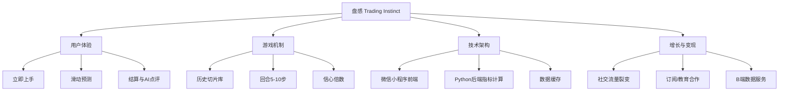

# 思维导图（可编辑，Mermaid + 文本）

下面提供 Mermaid 兼容的流程图/导图代码，你可以粘到支持 Mermaid 的工具（例如 Typora、Obsidian、Mermaid live editor）中查看或编辑。

## 文本版思维结构
- 用户体验
  - 立即上手、滑动预测、结算页、AI点评、分享
- 游戏机制
  - 切片库、难度均衡、信心倍数、得分机制
- 技术
  - 小程序前端、Python 后端、缓存历史切片、Claude 解释代理
- 增长与商业化
  - 社交流量、教学增值、品牌合作、数据服务
